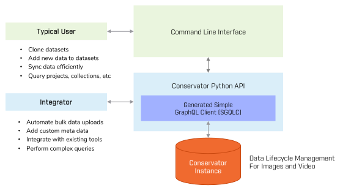

Welcome to Conservator CLI's documentation!
===========================================

Conservator CLI is the official Python library to interface with `Teledyne FLIR Conservator`_.

To get started, see the :doc:`usage/installation` guide. Then, get an overview using
the :doc:`usage/cli_quickstart` or :doc:`usage/api_quickstart`.

Conservator CLI uses `sgqlc`_ to generate Python interfaces for GraphQL queries.
The remainder of the library introduces layers of abstraction around this
interface to simplify operations and make scripting easier.

A sophisticated CLI is included via the ``conservator`` command, built on top of the library.

.. _`sgqlc`: https://github.com/profusion/sgqlc

.. _`Teledyne FLIR Conservator`: https://www.flir.com/oem/conservator/

Contents
========

.. toctree::
   :maxdepth: 3

   usage/installation
   usage/cli_quickstart
   usage/api_quickstart
   usage/api_advanced
   usage/cvc_guide
   usage/examples
   usage/upload_script
   api

Indices and tables
==================

* :ref:`genindex`
* :ref:`modindex`
* :ref:`search`
