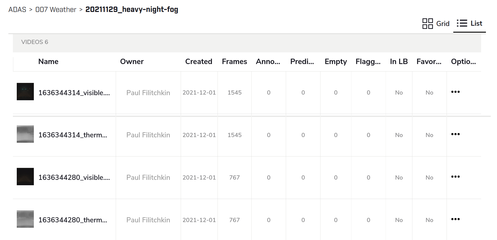
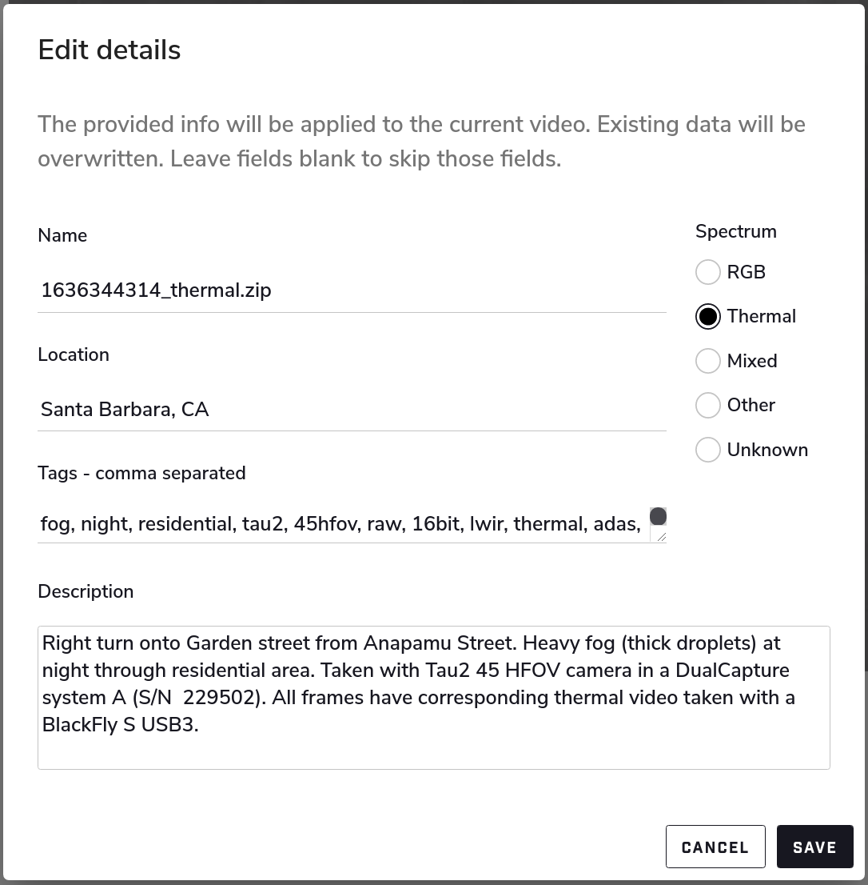

Conservator Upload Guide
========================

Conservator has several options to upload video data.
The supported formats include:

- Zip (or other archive format) of raw thermal tiffs
- Zip (or other archive format) of jpgs/pngs
- Multi-page .tiff
- Video: .mp4, .wmv, .mov, .gif, .ts, .seq, .csq
- Image: .jpg, .png, .bmp, .tiff
- Annotation data: .json, .xgtf

For more details see `Uploading a Video <https://docs.conservator.ai/sections/upload-video.html>`_ in the official Conservator docs.

Scripted Batch Upload
----------------------

The script ``examples/batch_upload/conservator_upload.py`` is provided to enable configurable, bulk upload of videos to your Conservator instance.
The features of this script include:

- Uploading data in batches using consistent naming conventions
- Configuring description, tags, and video source via a spreadsheet (csv)
- Uploading intrinsic, extrinsic, and multi-camera calibration parameters in a standardized way
- Ability to update existing metadata (i.e. run the scripts as many times as needed without extra overhead)
- Dry-run mode to preview upload/update operations before executing them

Pre-requisites
^^^^^^^^^^^^^^

- Please ensure that you have Conservator-CLI installed and configured per the :doc:`installation` guide.
- Please ensure that you have Python 3.x installed.
- The upload script requires the ``prettytable`` module; please run ``pip install prettytable`` to install it.

Upload Configs
^^^^^^^^^^^^^^

Each batch of uploads is stored in a separate folder and configured by:
- `upload.csv`  - list of videos to upload
- `upload.json` - metadata to associate with uploads (tags, description, intrinsics, extrinsics)

By default, the ``conservator_upload`` script will look for a directory named ``config`` in the same directory as it; i.e.:

::

  ├── conservator_upload.py
  │
  └── config/upload
      │
      ├── generic-video-example
      │   ├── upload.csv
      │   └── upload.json
      │
      ├── prism-example
      │   ├── upload.csv
      │   └── upload.json
      │
      └── {upload batch name}
          ├── upload.csv
          └── upload.json

If you want to skip uploading a video listed in an ``upload.csv`` file, simply comment it out by adding a ``#`` at the start of the line.
The following table describes the fields used in the ``upload.csv`` file:

+----------------------+----------------------------------------------------------------------------------------------------------------------------------------------------------------------------------------+
| Column Name          | Description                                                                                                                                                                            |
+======================+========================================================================================================================================================================================+
| type                 | Type of upload (``video`` or ``prism``).                                                                                                                                               |
+----------------------+----------------------------------------------------------------------------------------------------------------------------------------------------------------------------------------+
| hardware_name        | A key that specifies the capture hardware/sensor used for this upload (resolved in ``upload.json``).                                                                                   |
|                      | For the `video` type use JSON dot notation to specify the specific config (e.g. ``beamsplitter.thermal``)                                                                              |
+----------------------+----------------------------------------------------------------------------------------------------------------------------------------------------------------------------------------+
| conservator_location | Specifies which Conservator Project and Collection to upload to. Use your own conventions to organize projects.                                                                        |
|                      | **Format:** `PROJECT_NAME` / `FOLDER` / `SUBFOLDER` / `..`                                                                                                                             |
+----------------------+----------------------------------------------------------------------------------------------------------------------------------------------------------------------------------------+
| local_path           | The location on disk of the asset to upload (supports expansion of any user-defined environment variable)                                                                              |
+----------------------+----------------------------------------------------------------------------------------------------------------------------------------------------------------------------------------+
| tags                 | Comma separated list of tags to associate with this specific upload                                                                                                                    |
+----------------------+----------------------------------------------------------------------------------------------------------------------------------------------------------------------------------------+
| description          | Full-text description of the capture                                                                                                                                                   |
+----------------------+----------------------------------------------------------------------------------------------------------------------------------------------------------------------------------------+

List All Configuration Entries
^^^^^^^^^^^^^^^^^^^^^^^^^^^^^^

To list all available upload projects, run the script without any parameters (or with only a ``--config_root`` parameter):

::

 $ python examples/batch_upload/conservator_upload.py

 No config path provided, using default (/home/user/conservator-cli/examples/batch_upload/config/upload)
 +-----------------------+--------------------------------------------------------+
 | Config                | Description                                            |
 +-----------------------+--------------------------------------------------------+
 | generic-video-example | Beamsplitter upload batch for generic video example    |
 | prism-example         | Prism-formatted upload batch for generic video example |
 +-----------------------+--------------------------------------------------------+

Generic Video Example
---------------------

This example can be run using data included in this repository on any customer instance of Conservator.

::

  type,hardware_name,conservator_location,local_path,tags,description
  video,beamsplitter.thermal,/ADAS/Upload Test/20220112_generic-video-example,$CORTEX_ROOT/sample_data/offramp/thermal-video-B7JTS4i4hpoRgPsi2.mp4,"offramp, night","offramp at night with semi truck"
  video,beamsplitter.visible,/ADAS/Upload Test/20220112_generic-video-example,$CORTEX_ROOT/sample_data/offramp/visible-video-aJANTbw3WAW3oGkQB.mp4,"offramp, night","offramp at night with semi truck"

Note that ``beamsplitter.thermal`` is referring to the metadata defined in ``["default_metadata"]["beamsplitter"]["thermal"]`` within ``upload.json``, and that the ``conservator_location`` and ``local_path`` fields may need to be edited to reflect your user environment, and Conservator project setup respectively.

Here is an example from ``examples/batch_upload/config/upload/generic-video-example/upload.json``

::

  {
      "default_metadata": {
          "beamsplitter": {
              "thermal": {
                  "tags": [
                      "ADK",
                      "boson",
                      // ..
                  ],
                  "spectrum": "thermal",
                  "location": "Santa Barbara, California",
                  "description": "Captured with Boson sensor core (ADK)"
              },
              "visible": {
                  // ..
              }
          }
      },
      "#description": "The description here is only for reference and does not get uploaded",
      "description": "Beamsplitter upload batch for generic video example",
  }

Execute in Dry-Run Mode
^^^^^^^^^^^^^^^^^^^^^^^

This is useful to establish sanity checks before kicking off a large upload job.

::

  $ python3 examples/batch_upload/conservator_upload.py generic-video-example

  Video exists and is ready for upload: /home/user/sample_data/offramp/thermal-video-B7JTS4i4hpoRgPsi2.mp4

  Video exists and is ready for upload: /home/user/sample_data/offramp/visible-video-aJANTbw3WAW3oGkQB.mp4

  +-------------------------------------------------+-------+
  | Name                                            | Count |
  +-------------------------------------------------+-------+
  | Total entries                                   | 2     |
  | Total entries commented out by user             | 0     |
  | Total entries that are invalid                  | 0     |
  | Videos would be uploaded                        | 2     |
  | Videos ACTUALLY uploaded                        | 0     |
  | Videos currently being processed by Conservator | 0     |
  | Video metadata updated                          | 0     |
  +-------------------------------------------------+-------+
  ---------------------------------------------------------------------------
   NOTE: No data was uploaded. Set --dry_run=false to upload
  ---------------------------------------------------------------------------

Execute Actual Upload
^^^^^^^^^^^^^^^^^^^^^

::

  $ python examples/batch_upload/conservator_upload.py generic-video-example --dry_run=false

  20:53:56 | Uploading "thermal-video-B7JTS4i4hpoRgPsi2.mp4"
  20:53:56 |    File on disk:         /home/user/sample_data/offramp/thermal-video-B7JTS4i4hpoRgPsi2.mp4
  20:53:56 |    Conservator location: /ADAS/Upload Test/20220112_generic-video-example
  20:54:02 |    Success! See:         https://flirconservator.com/videos/6PGfdWgAoHa2tnx2o
  20:54:02 |
  20:54:03 | Uploading "visible-video-aJANTbw3WAW3oGkQB.mp4"
  20:54:03 |    File on disk:         /home/user/prism-ai-tools/sample_data/offramp/visible-video-aJANTbw3WAW3oGkQB.mp4
  20:54:03 |    Conservator location: /ADAS/Upload Test/20220112_generic-video-example
  20:54:07 |    Success! See:         https://flirconservator.com/videos/bGGbuopzoKjvoYixv
  20:54:07 |
  +-------------------------------------------------+-------+
  | Name                                            | Count |
  +-------------------------------------------------+-------+
  | Total entries                                   | 2     |
  | Total entries commented out by user             | 0     |
  | Total entries that are invalid                  | 0     |
  | Videos would be uploaded                        | 2     |
  | Videos ACTUALLY uploaded                        | 2     |
  | Videos currently being processed by Conservator | 0     |
  | Video metadata updated                          | 0     |
  +-------------------------------------------------+-------+

Prism Example
-------------

Here is an example of `upload.csv` with 3 Prism uploads (3 thermal videos + 3 frame synced visible videos).
The full contents are in ``examples/batch_upload/config/upload/prism-example/upload.csv``.

**The example will fail if you do not have the original data, but it provides a batch upload blueprint**

::

  type,hardware_name,conservator_location,local_path,tags,description
  prism,dc,/ADAS/Upload Test/20220112_prism-example/,$CORTEX_ROOT/sample_data/night_fog,"fog, night, parking lot, person","Person walking in parking lot at 60m"

Here is an example from ``examples/batch_upload/config/upload/prism-example/upload.json``:
::

    {
      "default_metadata": {
        "dc": {
            "thermal": {
                "tags": [
                    "45hfov",
                    "raw",
                    "16bit",
                    "lwir"
                ],
                "spectrum": "thermal",
                //..
            },
            "rgb": {
                // ..
            }
        }
      },
      "#description": "This description is for the upload batch",
      "description": "Prism-formatted upload batch for generic video example"
    }

Execute in Dry-Run Mode
^^^^^^^^^^^^^^^^^^^^^^^
::

  $ python examples/batch_upload/conservator_upload.py 20211129_heavy-night-fog

  2021-12-06 16:47:49,192 - upload - INFO - Zipping 1636345107_thermal.zip (conservator_upload.py:314)
  2021-12-06 16:48:04,901 - upload - INFO - Zipping 1636345107_visible.zip (no compression) (conservator_upload.py:336)
  +-------------------------------------------------+-------+
  | Name                                            | Count |
  +-------------------------------------------------+-------+
  | Total entries                                   | 3     |
  | Total entries commented out by user             | 2     |
  | Total entries that are invalid                  | 0     |
  | Videos would be uploaded                        | 2     |
  | Videos ACTUALLY uploaded                        | 0     |
  | Videos currently being processed by Conservator | 0     |
  | Video metadata would upload                     | 0     |
  | Video metadata ACTUALLY uploaded                | 0     |
  +-------------------------------------------------+-------+
  ---------------------------------------------------------------------------
   NOTE: No data was uploaded. Set --dry_run=false to upload
  ---------------------------------------------------------------------------

Execute
^^^^^^^

::

  $ python examples/batch_upload/conservator_upload.py 20211129_heavy-night-fog --dry_run=false

  2021-12-06 16:00:57,925 - upload - INFO - Uploading 1636345107_thermal.zip to project: "/ADAS/007 Weather/20211129_heavy-night-fog" (conservator_upload.py:196)
  2021-12-06 16:05:42,730 - upload - INFO - Uploaded video with id: "fPEhjR7yhebcvrJBS" (conservator_upload.py:233)
  2021-12-06 16:06:00,369 - upload - INFO - Uploading 1636345107_visible.zip to project: "/ADAS/007 Weather/20211129_heavy-night-fog" (conservator_upload.py:196)
  +-------------------------------------------------+-------+
  | Name                                            | Count |
  +-------------------------------------------------+-------+
  | Total entries                                   | 3     |
  | Total entries commented out by user             | 2     |
  | Total entries that are invalid                  | 0     |
  | Videos would be uploaded                        | 2     |
  | Videos ACTUALLY uploaded                        | 2     |
  | Videos currently being processed by Conservator | 0     |
  | Video metadata would upload                     | 0     |
  | Video metadata ACTUALLY uploaded                | 0     |
  +-------------------------------------------------+-------+

Expected Data in Conservator
^^^^^^^^^^^^^^^^^^^^^^^^^^^^

For this example the videos can be found in the **ADAS** project under the **007 Weather** / **20211129_heavy-night-fog** collection.

The basic information can be found from the "Edit Details" dialog

All camera and related parameters can be found in the **Video Details** in **Custom Metadata**

.. image:: ../_static/images/video-upload-custom-details.png
    :width: 820px
    :alt: Conservator edit video details dialog